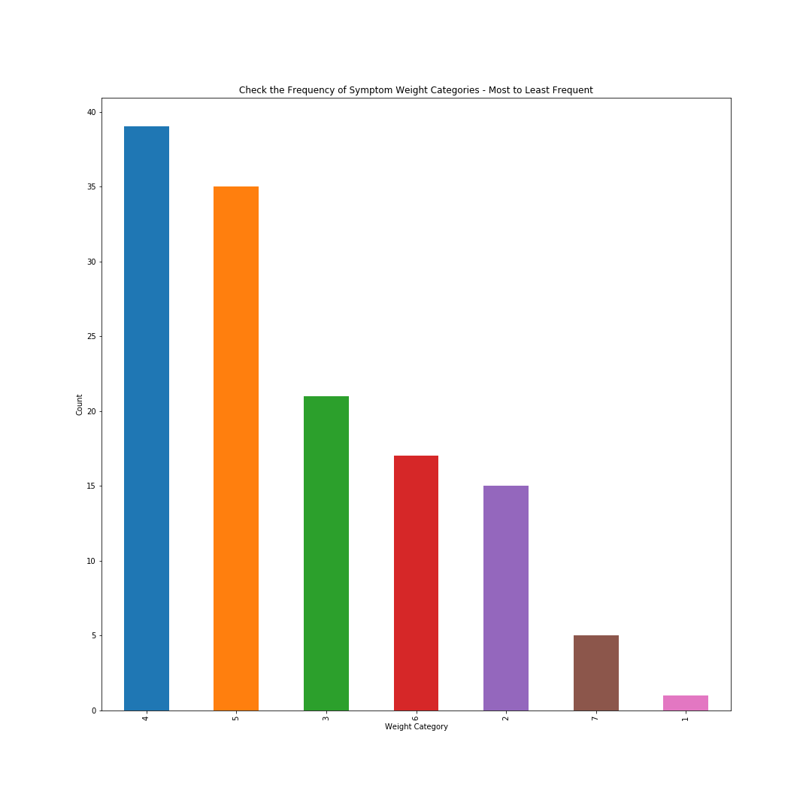
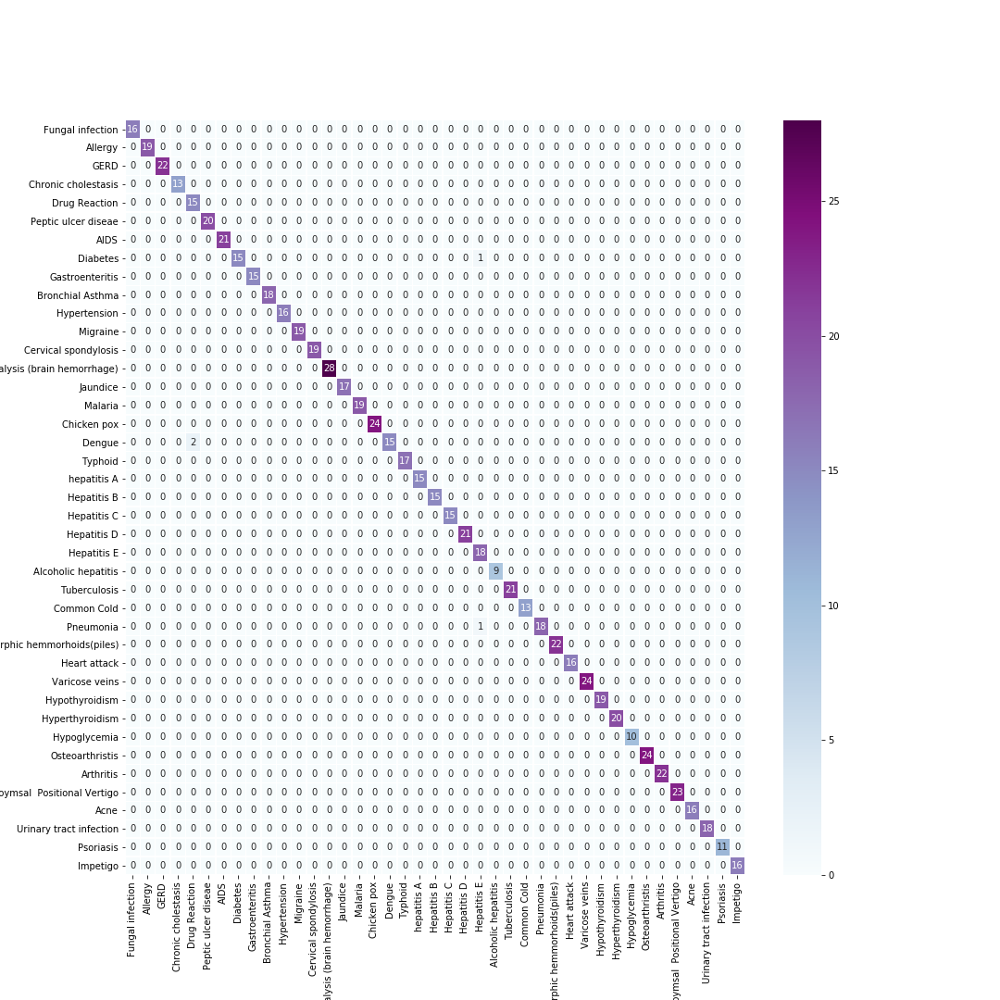

## Disease Prediction with Python - Machine Learning Algorithms 

This set of code uses numpy, pandas, matplotlib, seaborn, pickle, and sklearn for determining the most accurate disease based on the set of 17 symptoms. Additionally, another data set includes the symptoms with a weight ranking variable (values 1-7) for each symptom. First we explore using random forest based on just the symptoms and predicting disease. The prediction is further refined by incorporating the symptom weights for the disease prediction. Since a few of the symptoms (see code for details) did not have a weight value in the data set provided, the values were imputed based on some exploratory analysis of the distribution of weight rankings as well as the distribution of symptoms for that corresponding disease (see below). A confusion matrix was created, and determined a disease match accuracy of ~98.0%-99.5%. A random forest was used for this new addition of weight rankings, and the accuracy was ~99%. After loading the model into pickle and test running, the model maintained ~99% accuracy in determining the disease based on symptoms and symptom weight.

Citation
This data set was obtained from https://www.kaggle.com/datasets/itachi9604/disease-symptom-description-dataset on 5/12/2023 under the following license: https://creativecommons.org/licenses/by-sa/4.0/ as listed on the author's page. No additional authorship or citation information was provided. This license allows the user to share and adapt the material as long as appropriate credit is given, and changes need to be acknowledged. There were no changes to this material, and this is for educational purposes only.

### Distribution of Symptom Severity Weight Values (from most frequent weight value to least)

### Confusion Matrix for Disease Prediction

